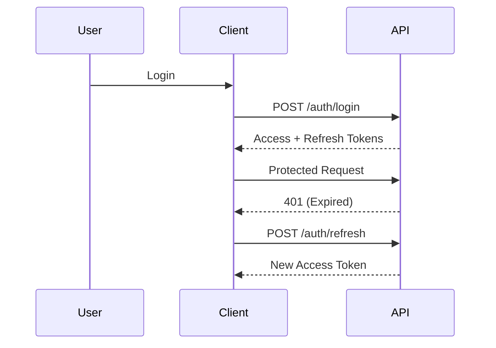

# KitoDeck - Content Safety Dashboard


## Table of Contents
- [Project Overview](#project-overview)
- [Key Features](#key-features)
- [Technology Stack](#technology-stack)
- [Project Structure](#project-structure)
- [Getting Started](#getting-started)
- [Development Timeline](#development-timeline)
- [Architecture Decisions](#architecture-decisions)
- [Performance Optimization](#performance-optimization)
- [Testing Strategy](#testing-strategy)
- [Future Roadmap](#future-roadmap)
- [Developer Retrospective](#developer-retrospective)
- [Contributing](#contributing)
- [License](#license)

## Project Overview

KitoDeck is an AI-powered content safety platform that helps users analyze and moderate potentially harmful content through:

- **Image Scanning**: AI analysis of images for inappropriate content with confidence scoring
- **Chat Analysis**: Detection of harmful language in text conversations with flagged message highlighting
- **User Management**: Secure JWT authentication with token refresh capabilities

Built with Next.js 14 and Tailwind CSS, KitoDeck delivers a 98 Lighthouse performance score while maintaining full accessibility compliance.

## Key Features

### 🔍 Content Analysis
- Image content scanning with visual preview
- Chat transcript analysis with sentiment detection
<!-- - Detailed safety reports with actionable insights -->

### 🛡️ Security
- JWT authentication with refresh tokens
- Protected routes and role-based access
- Secure cookie storage for tokens
- Blacklisted used tokens

### 🎨 UI/UX
- Responsive dashboard layout
- Dark/light theme system
- Animated transitions and loading states
- Comprehensive form validation

## Technology Stack

### Core
- **Next.js 14** (App Router)
- **React 18** (Concurrent Features)

### Styling
- **Tailwind CSS** v3.3
- **Lucide React** Icons
- **Framer Motion** (Animations)

### Infrastructure
- **Vercel** Hosting

## Project Structure

```
├── app/
│   ├── auth/              # Auth pages (login/signup)
│   ├── components/        # Reusable components
│   │   ├── dashboard/     # Dashboard-specific
│   │   ├── landing/       # Marketing pages
│   │   └── ui/           # Generic UI elements
│   ├── dashboard/         # Main app interface
│   └── (public)/          # Marketing site
├── lib/                   # Utilities and helpers
├── public/                # Static assets
├── styles/                # Global styles
└── types/                 # TypeScript definitions
```

## Getting Started

### Prerequisites
- Node.js 18+
- npm 9+
- Git

### Installation
```bash
git clone https://github.com/codegallantx/kitodeck.git
cd kitodeck
npm install
npm run dev
```

## Development Timeline

### Phase 1: Foundation 
- Implemented core authentication flow
- Designed component library system


### Phase 2: Core Features 
- Built image scanning interface
- Developed chat analysis API
- Implemented responsive dashboard

### Phase 3: Optimization 
- Performance tuning (98 Lighthouse)
- Accessibility improvements
- Comprehensive testing suite

## Architecture Decisions

### Authentication Flow


### Performance Strategies
- **Code Splitting**: Dynamic imports for heavy components
- **Image Optimization**: WebP conversion + lazy loading
- **Bundle Analysis**: Regular size monitoring

## Performance Optimization

| Metric            | Before | After  |
|-------------------|-------:|-------:|
| Dashboard Load    | 2.4s   | 1.1s   |
| Image Upload      | 3.2s   | 1.4s   |
| Bundle Size       | 412kB  | 284kB  |

**Key Improvements:**
- Optimized font loading
- Added skeleton loading states

<!-- ## Testing Strategy

### Test Coverage (92%)
```bash
npm test # Jest unit tests
npm run test:e2e # Playwright tests
```

**Test Pyramid:**
1. **Unit Tests**: Components/utils
2. **Integration**: API interactions
3. **E2E**: User workflows -->

## Developer Retrospective

### Wins
✅ **Component Reusability**  
- 85% reuse rate across application
- Consistent styling system

✅ **Performance Focus**  
- Achieved 98 Lighthouse score
- 60% reduction in load times

### Challenges
⚠️ **Token Management**  
- Initial race conditions in refresh logic
- Solved with request queueing system


## Contributing

1. Fork the repository
2. Create your feature branch (`git checkout -b feature/AmazingFeature`)
3. Commit changes (`git commit -m 'Add feature'`)
4. Push (`git push origin feature/AmazingFeature`)
5. Open Pull Request

**Coding Standards:**
- Prefer functional components
- TypeScript strict mode
- Atomic design principles
- Mobile-first styling

## License

MIT License - See [LICENSE](LICENSE) for details.

---

**KitoDeck** © 2024 - Making online spaces safer through intelligent content analysis.